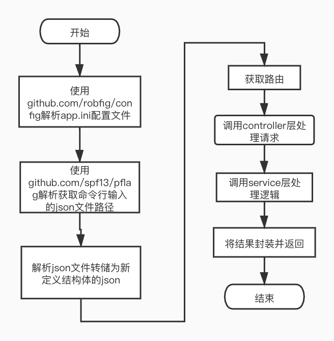

# 整体框架
```text
1. app.ini配置文件解析,通过第三方go包github.com/robfig/config读取.int配置文件，使用的函数如下：
	c, _ := config.ReadDefault("./config/app.ini").  //读取配置文件
	httpPort, _ := c.String("server", "HttpPort")  //获取server标签下的HttpPort字段值
2. 读取命令行参数，获得json文件的路径：
	var CliJsonPath = flag.StringP("json-path", "p", "./config/config.army.model.json", "Input Json Path")
	func GetJsonPath() string {
		// 设置标准化参数名称的函数
		flag.CommandLine.SetNormalizeFunc(wordSepNormalizeFunc)
		flag.Parse()
		return *CliJsonPath
	}
3. 项目整体流程实现：
   首先通过解析app.ini配置文件获取端口号。
   通过读取命令行输入的参数，获取json文件的路径。
   更具路径找到json文件并解析，将其转储为新定义的结构体的json文件
   获取路由，调用controller层，处理http请求并返回参数
4. 项目整体流程图如下图所示：
```


# 目录结构
```text
.
├── config
│   ├── app.ini                  //app.ini配置文件
│   ├── config.army.model.json   //json文件
│   └── new.soldier.dto.json     //新的结构体转储的json文件
├── controller
│   └── soldierController.go     //处理http请求和响应
├── doc
│   └── img.jpg                  //题目1的流程图
├── entity
│   ├── Result.go                //响应数据的格式
│   ├── Soldier.go               //老json文件的士兵
│   └── SoldierDTO.go            //新json文件的士兵
├── go.mod
├── go.sum
├── load
│   ├── project1_test.py         //压力测试代码
│   └── report1.html             //压力测试报告
├── main
│   └── main.go                  //项目启动
├── service
│   └── soldierService.go        //处理获取士兵信息的逻辑
├── test
│   └── soldierService_test.go   //单元测试
└── util
    ├── getCommand.go            //解析命令行
    └── jsonToFile.go            //解析json文件并转储为新结构体的json文件
```
# 代码逻辑分层
层|文件夹|主要职责
------------ | ------------- | ------------- 
应用层|controller|负责接收请求和返回响应
服务层|service|负责处理获取士兵信息的逻辑
实体层|entity|封装实体结构体
单元测试层|test|测试计算器是否功能正常
工具层|util|解析命令行，转储json文件
启动层|main|启动项目，调用应用层处理http请求
压力测试层|load|测试项目的压力

# 存储设计
### 返回结果封装为Result结构：状态码，信息，数据
内容|field|类型
------------ | ------------- | ------------- 
状态码|Code|int
信息|Msg|string
数据|Data|interface{}

### 错误码和信息
错误码|信息
------------ | -------------
200|"请求成功"
3000|"rarity不能为空"
3001|"unlockArena不能为空"
3002|"cvc不能为空"
3003|"id不能为空"
4001|"数据库为空"
4002|"该用户不存在"


# 接口设计
# 需求1：输入稀有度，当前解锁阶段和cvc，获取该稀有度cvc合法且已解锁的所有士兵
### http请求方法：
http  GET
### 接口地址：
localhost:8000/soldier/getAll
### 请求参数：
参数名|参数类型|注释|是否必填
------------ | ------------- | ------------- | -------------
rarity|string|稀有度|必填
unlockArena|string|解锁阶段|必填
cvc|string|版本|必填

### 请求响应：
响应结果为json数据，数据格式如下：

参数名|参数类型|注释
------------ | ------------- | -------------
Code|int|状态码
Msg|string|信息
Data|interface{}|interface{}数据

json格式如下：
```java
{
	"code":200,
	"Msg":"找到符合信息的士兵",
	"Data": [
			{
				"id":"10102",        //士兵id
				"Name":"Swordsman",  //士兵名字
				"UnlockArena":"0",   //解锁阶段
				"Rarity":"1",        //稀有度
				"Atk":"140"          //战斗力
				"cvc":"1000"
			}
		]
}
```

# 需求2：输入士兵id获取稀有度
### http请求方法：
http  GET
### 接口地址：
localhost:8000/soldier/getRarity 
### 请求参数：
参数名|参数类型|注释|是否必填
------------ | ------------- | ------------- | -------------
id|string|士兵id|必填
### 请求响应：
响应结果为json数据，数据格式如下：

参数名|参数类型|注释
------------ | ------------- | -------------
Code|int|状态码
Msg|string|信息
Data|interface{}|interface{}数据

json格式如下：
```java
{
	"code":200,
	"Msg":"找到了该士兵的稀有度",
	"Data": 2
}
```

# 需求3：输入士兵id获取战斗力
### http请求方法：
http  GET
### 接口地址：
localhost:8000/soldier/getAtk
### 请求参数：
参数名|参数类型|注释|是否必填
------------ | ------------- | ------------- | -------------
id|string|士兵id|必填
### 请求响应：
响应结果为json数据，数据格式如下：

参数名|参数类型|注释
------------ | ------------- | -------------
Code|int|状态码
Msg|string|信息
Data|interface{}|interface{}数据

json格式如下：
```java
{
	"code":200,
	"Msg":"找到符合信息的士兵",
	"Data": 3
}
```


# 需求4：输入cvc获取所有合法的士兵 
### http请求方法：
http  GET
### 接口地址：
localhost:8000/soldier/getByCvc
### 请求参数：
参数名|参数类型|注释|是否必填
------------ | ------------- | ------------- | -------------
cvc|string|版本号|必填
### 请求响应：
响应结果为json数据，数据格式如下：

参数名|参数类型|注释
------------ | ------------- | -------------
Code|int|状态码
Msg|string|信息
Data|interface{}|interface{}数据

json格式如下：
```java
{
	"code":200,
	"msg":"请求成功",
	"data":[{
		"id":"17806",
		"Name":"Crossbowmen",
		"UnlockArena":"6",
		"Rarity":"3",
		"Atk":"269",
		"Cvc":"1000"
		},]
}
```

# 需求5：获取每个阶段解锁相应士兵的json数据
### http请求方法：
http  GET
### 接口地址：
localhost:8000/soldier/getAll/unlockArena
### 请求参数：无
### 请求响应：
响应结果为json数据，数据格式如下：

参数名|参数类型|注释
------------ | ------------- | -------------
Code|int|状态码
Msg|string|信息
Data|interface{}|interface{}数据

json格式如下：
```java
{
	"code":200,
	"Msg":"找到符合信息的士兵",
	"Data": [
			0:{
			   {
			       "id":"10102",        //士兵id
			       "Name":"Swordsman",  //士兵名字
			       "UnlockArena":"0",   //解锁阶段
			       "Rarity":"1",        //稀有度
			       "Atk":"140"          //战斗力
			       "cvc":"1000"
			    }
			}
		]
}
```

# 第三方库
### gin
```text
github.com/gin-gonic/gin
使用gin框架获取http请求以及返回http响应
```
### config
```text
github.com/robfig/config
使用这个第三方包解析app.ini配置文件
```
### pflag
```text
github.com/spf13/pflag
使用这个第三方包解析命令行参数
```
