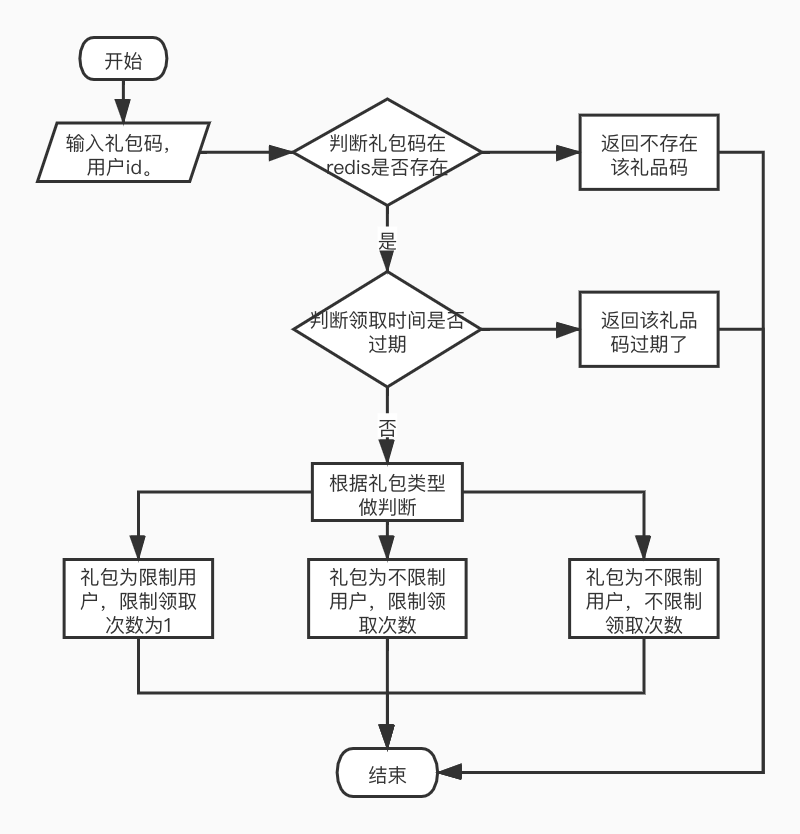

# 整体框架
```text
项目整体流程实现：
   第一个创建礼品码的需求：
     先获得请求参数，将请求参数封装到礼品码内容结构体中，
     通过randCode中的函数获得礼品码，将礼品码和礼品码内容放到redis中，将礼品码返回。
   第二个查询礼品码内容的需求：
     获得请求参数礼品码，根据礼品码去redis寻找到礼品码内容。
     将礼品码内容返回。
   第三个用户获取奖励的需求：
     1. 通过礼品码从redis获取礼品内容，如果报错，返回错误信息礼包码不正确，没有报错，就证明礼包码正确
     2. 将现在的领取时间和礼包内容里的有效期转为time类型比较是否超过期限，如果超过了，返回‘取时间超过限定日期’，
     没有则继续往下判断
     3. 判断礼包的类型字段‘CodeType’
     4. 如果为1，礼包类型为指定用户，限制可领取次数为1次的礼包， 判断是否被领取过，
     如果没：将已领取次数变为0，领取列表，可领取次数修改后将新的礼包内容重新放回redis，并将其中的礼包信息返回。
     如果有：则直接返回‘该礼包已经被领取了‘
     5. 如果为2，礼包类型为不指定用户，可领取次数为固定的礼包，判断该礼包的是否可以继续领取，如果不能，则返回‘该礼包已经没有了’，
     如果能，则将已领取次数减少，领取列表，可领取次数修改后将新的礼包内容重新放回redis，并将其中的礼包信息返回。
     6. 如果为3，礼包类型为不指定用户，可领取次数为无限的礼包，
     将已领取次数，领取列表，可领取次数修改后将新的礼包内容重新放回redis，并将其中的礼包信息返回。
```
# 需求三的执行流程图如下所示：


# 目录结构
```text
.
├── README.md
├── controller
│   ├── adminController.go       //管理员处理请求和响应
│   └── userController.go        //用户处理请求和响应
├── doc
│   └── img.jpg                  //需求3的流程图
├── entity
│   ├── gift.go                  //奖品内容
│   ├── giftContent.go           //礼品码内容
│   └── result.go                //响应结果的封装
├── go.mod
├── load
│   ├── project3_report.html     //压测报告
│   └── project3_test.py         //压测代码
├── main
│   └── main.go                  //启动项目的文件
├── service
│   ├── adminService.go          //管理员处理需求1和需求2的逻辑
│   └── userService.go           //用户处理需求3的逻辑
├── test
│   ├── adminService_test.go     //单元测试管理员功能
│   └── userService_test.go      //单元测试用户功能
├── util
│   ├── randCode.go              //获取随机8位礼品码
│   └── redisUtil.go             //封装对redis的操作
└── web
    └── html
        └── createCode.html      //管理员创建礼包内容的页面
```
# 代码逻辑分层
层|文件夹|主要职责
------------ | ------------- | ------------- 
应用层|controller|负责接收请求和返回响应
服务层|service|负责处理管理员和用户的业务逻辑
实体层|entity|封装实体结构体
单元测试层|test|测试计算器是否功能正常
工具层|util|获取8位礼品码，go语言对redis的操作
启动层|main|启动项目，调用应用层处理http请求
压力测试层|load|测试项目的压力
视图层|web|管理员创建礼包内容的页面

# 存储设计
### 返回结果封装为Result结构：状态码，信息，数据
内容|field|类型
------------ | ------------- | ------------- 
状态码|Code|int
信息|Msg|string
数据|Data|interface{}
### 奖品内容：奖品名字，奖品数量
内容|field|类型
------------ | ------------- | ------------- 
奖品名字|Name|string
奖品数量|Num|string
### 礼包内容：创建时间，创建用户，礼包描述，奖品内容列表，
### 可领取次数，有效期，已领取次数，领取列表，指定用户ID,礼品码类型
内容|field|类型
------------ | ------------- | ------------- 
创建时间|GmtCreate|string
创建用户|CreateUser|string
礼包描述|Describe|string
奖品内容列表|GiftList|[]Gift
可领取次数|ReceiveNum|string
有效期|UsefulDate|string
已领取次数|AlreadyNum|string
领取列表|DrawList|map[string]string
指定用户ID|DrawId|string
礼品码类型|CodeType|string


# 接口设计
# 需求1：管理后台调用 - 创建礼品码
### http请求方法：
http  POST
### 接口地址：
localhost:8000/admin/create
### 请求参数：
参数名|参数类型|注释
------------ | ------------- | -------------
uid|string|用户id
codeType|string|礼包类型
describe|string|礼包描述
receiveNum|string|可领取次数
usefulDate|string|有效期
jewel|string|钻石数量
gold|string|金子数量
props|string|道具数量
hero|string|英雄数量
batman|string|小兵数量
### 请求响应：
##### 响应结果为json数据，数据格式如下：
参数名|参数类型|注释
------------ | ------------- | -------------
Code|int|状态码
Msg|string|信息
Data|interface{}|interface{}数据

##### json格式如下：
```java
{
    "code":200,
    "msg":"请求成功",
    "data":"liRMjgVU"
}
```
##### 响应状态码：
状态码|说明
------------ | ------------- 
200|"请求成功"
4001|"json序列化错误"
50001|"redis服务有问题"


# 需求2：管理后台调用 - 查询礼品码信息：
### http请求方法：
http  GET
### 接口地址：
localhost:8000/admin/select
### 请求参数：
参数名|参数类型|注释
------------ | ------------- | -------------
code｜string|礼品码
### 请求响应：
##### 响应结果为json数据，数据格式如下：

参数名|参数类型|注释
------------ | ------------- | -------------
Code|int|状态码
Msg|string|信息
Data|interface{}|interface{}数据

##### json格式如下：
```java
{
    "gmtCreate":"2021-06-17 20:08:06",    //创建时间
    "createUser":"管理员",                 //创建用户
    "describe":"很牛逼",                   //礼品描述
    "giftList":[                          //礼品内容列表
        {
            "name":"jewel",               //礼品名称
            "num":"2"                     //礼品数量
        },
        {
            "name":"gold",
            "num":"4"
        },
        {
            "name":"props",
            "num":"65"
        },
        {
            "name":"hero",
            "num":"4"
        },
        {
            "name":"batman",
            "num":"0"
        }
    ],
    "receiveNum":"7",                    //可领取次数
    "usefulDate":"2021-06-26 15:04:05",  //有效期
    "alreadyNum":"1",                    //已领取次数
    "drawList":{                         //领取列表
        "2021-06-17 20:09:31":"李四"
    },
    "drawId":"",                         //指定用户的Id
    "codeType":"2"   //礼品码类型 1:指定用户一次性消耗，2：不指定用户限制兑换次数，3：不限用户，不限兑换次数
}
```
##### 响应状态码：
状态码|说明
------------ | ------------- 
200|"请求成功"
40001|"json序列化错误"

# 需求3：客户端调用 - 验证礼品码：
### http请求方法：
http  GET
### 接口地址：
localhost:8000/user/check
### 请求参数：
参数名|参数类型|注释
------------ | ------------- | -------------
uid|string|用户id
code|string|礼品码
### 请求响应：
##### 响应结果为json数据，数据格式如下：

参数名|参数类型|注释
------------ | ------------- | -------------
Code|int|状态码
Msg|string|信息
Data|interface{}|interface{}数据

##### json格式如下：
```java
[
    {
        "name":"jewel",           //礼品名字
        "num":"2"                 //礼品数量
    },
    {
        "name":"gold",
        "num":"4"
    },
    {
        "name":"props",
        "num":"65"
    },
    {
        "name":"hero",
        "num":"4"
    },
    {
        "name":"batman",
        "num":"0"
    }
]
```
##### 响应状态码：
状态码|说明
------------ | ------------- 
200|"请求成功"
30001|"礼包码不正确"
30002|"该礼包已经被领取了"
30003|"该礼包已经没有了"
30004|"不是指定的用户领取"
30005|"领取时间超过限定日期"
40001|"json序列化错误"
50001|"redis服务有问题"

# 第三方库
### gin
```text
github.com/gin-gonic/gin
使用gin框架获取http请求以及返回http响应
```
### redis
```text
github.com/go-redis/redis/v8
使用redis框架简化go语言操作redis的操作
```

