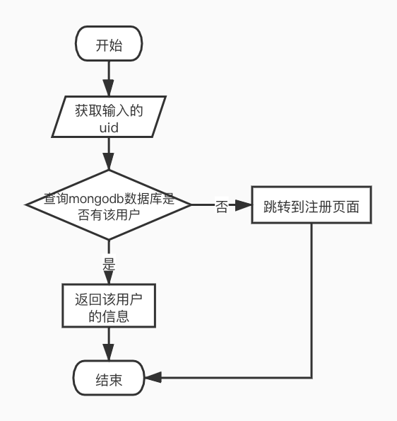
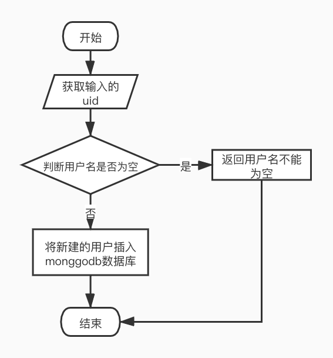

# 整体框架
```text
项目整体流程实现：
   第一个用户登录的需求：
     获取前端传过来的uid，根据uid去mongodb查找是否存在该用户。
     存在返回用户信息，不存在则跳转到用户注册页面。
   第二个用户注册的需求：
     获取前端传过来的username，判断username是否为空。
     如果为空，则返回用户名不能为空的信息。
     如果不为空，则通过函数UniqueId()获取唯一用户id，将信息封装插入mongodb
   第三个将用户获取礼包内容的返回格式改为protobuf格式返回：
     将所有返回的结果由protobuf序列化返回
```
# 用户登录的执行流程图如下所示：

# 用户注册的执行流程图如下所示：


# 目录结构
```text
.
├── controller
│   ├── adminController.go     //管理员处理请求和响应
│   └── userController.go      //用户处理请求和响应
├── dao
│   └── userDao.go             //go语言操作mongodb数据裤操作
├── doc
│   ├── login.jpg              //用户登录流程图
│   └── register.jpg           //用户注册流程图
├── entity
│   ├── gift.go                //奖品内容
│   ├── giftContent.go         //礼包内容
│   ├── result.go              //响应结果
│   └── user.go                //用户信息
├── general.proto              //礼包内容返回的proto格式
├── go.mod
├── load
│   ├── project4_test.py       //压力测试代码
│   └── report_1624245442.663886.html      //压力测试报告
├── route
│   └── route.go                //路由管理
├── main
│   └── main.go                //项目启动文件
├── response
│   └── general.pb.go          //protobuf的go文件
├── service
│   ├── adminService.go        //管理员的逻辑处理
│   └── userService.go         //用户的逻辑处理
├── test
│   ├── adminService_test.go   //单元测试
│   └── userService_test.go    //单元测试
├── util
│   ├── getUniqueId.go         //获取唯一uid
│   ├── mongodbUtil.go         //获取mongodb连接
│   ├── randCode.go            //获取随机礼包码
│   └── redisUtil.go           //go语言操作redis
└── web
    └── html
        └── createCode.html    //创建礼包内容的页面
```
# 代码逻辑分层
层|文件夹|主要职责
------------ | ------------- | ------------- 
应用层|controller|负责接收请求和返回响应
服务层|service|负责处理管理员和用户的业务逻辑
实体层|entity|封装实体结构体
单元测试层|test|测试计算器是否功能正常
工具层|util|获取8位礼品码，go语言对redis的操作
启动层|main|启动项目，调用应用层处理http请求
压力测试层|load|测试项目的压力
视图层|web|管理员创建礼包内容的页面
路由管理层|route|管理路由
响应结果层|response|封装了protobuf格式的响应结果

# 存储设计
### 返回结果封装为Result结构：状态码，信息，数据
内容|field|类型
------------ | ------------- | ------------- 
状态码|Code|int
信息|Msg|string
数据|Data|interface{}
### 奖品内容：奖品id，奖品名字，奖品数量
内容|field|类型
------------ | ------------- | ------------- 
奖品id|Gid|uint32
奖品名字|Name|string
奖品数量|Num|uint64
### 礼包内容：创建时间，创建用户，礼包描述，奖品内容列表，
### 可领取次数，有效期，已领取次数，领取列表，指定用户ID,礼品码类型
内容|field|类型
------------ | ------------- | ------------- 
创建时间|GmtCreate|string
创建用户|CreateUser|string
礼包描述|Describe|string
奖品内容列表|GiftList|[]Gift
可领取次数|ReceiveNum|int
有效期|UsefulDate|string
已领取次数|AlreadyNum|int
领取列表|DrawList|map[string]string
指定用户ID|DrawId|string
礼品码类型|CodeType|string
### 用户信息：用户id，用户名字，钻石余额，金币余额
内容|field|类型
------------ | ------------- | ------------- 
用户id|Uid|string
用户名字|UserName|string
钻石余额|GemBalance|Gift
金币余额|GoldBalance|Gift
### 状态码和对应的信息
状态码|信息
------------ | ------------- 
10100|"该礼包已经被领取了"
10101|"该礼包已经被领完了"
10102|"不是指定用户领取"
10103|"超过礼品码限定日期"
200|请求成功
20100|"该用户未注册"
20002|"用户插入失败"
30100|"该礼包码不正确"
30101|"redis中礼品内容修改失败"
4001|"uid不能为空"
4002|"code不能为空"
4003|"username不能为空"
50001|"json序列化失败"
50002|"redis服务错误"

# 接口设计
# 需求1：用户登录
### http请求方法：
http GET
### 接口地址：
localhost:8000/user/login
### 请求参数：
参数名|参数类型|注释
------------ | ------------- | -------------
uid|string|用户id
### 请求响应：
##### 响应结果为json数据，数据格式如下：
参数名|参数类型|注释
------------ | ------------- | -------------
Code|int|状态码
Msg|string|信息
Data|interface{}|interface{}数据

##### json格式如下：
```java
{
    "code":200,
    "msg":"请求成功",
    "data": 
        {
            "uid" : "asdadbucsaiewqdsasdf"
            "username" : "天龙人"
            "gembalance" : 4
            "goldbalance" : 4
        }
}
```

# 需求2：用户注册：
### http请求方法：
http  GET
### 接口地址：
localhost:8000/user/register
### 请求参数：
参数名|参数类型|注释
------------ | ------------- | -------------
username｜string|用户名
### 请求响应：
##### 响应结果为json数据，数据格式如下：

参数名|参数类型|注释
------------ | ------------- | -------------
Code|int|状态码
Msg|string|信息
Data|interface{}|interface{}数据

##### json格式如下：
```java
{
    "code":200,
    "msg":"请求成功",
    "data": "asdadbucsaiewqdsasdf"
}
```

# 需求3：客户端调用 - 验证礼品码：
### http请求方法：
http  GET
### 接口地址：
localhost:8000/user/check
### 请求参数：
参数名|参数类型|注释
------------ | ------------- | -------------
uid|string|用户id
code|string|礼品码
### 请求响应：
##### 响应结果为protobuf数据，数据格式如下：
参数名|参数类型|注释
------------ | ------------- | -------------
Code|int32|状态码
Msg|string|信息
Changes|map[uint32]uint64|奖品奖励
Balance|map[uint32]uint64|奖励后的账户余额


# 第三方库
### gin
```text
github.com/gin-gonic/gin
使用gin框架获取http请求以及返回http响应
```
### redis
```text
github.com/go-redis/redis/v8
使用redis框架简化go语言操作redis的操作
```
### protobuf
```text
github.com/golang/protobuf
使用protobuf解析protobuf文件，将其转为go文件
```
### mongo
```text
go.mongodb.org/mongo-driver
使用mongo-driver简化go语言操作mongodb的开发
```

