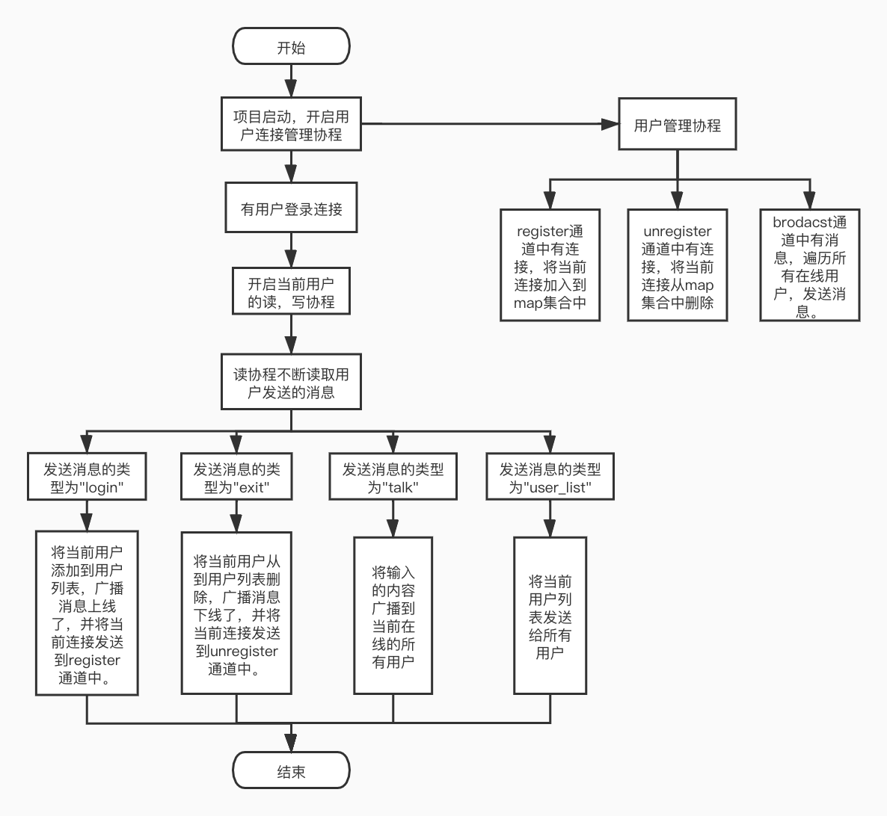

# 整体框架
```text
题目5的功能：
1） 接受客户端发起的连接请求，建立ws连接
2） 维护管理多用户的ws连接
3） 收到talk类型消息，记录日志，把收到消息转发给所有连接的用户
4） 收到exit类型消息，断开连接，清理用户信息
5） 收到userlist消息，返回所有在线用户username
实现流程：
首先通过websocket将http请求升级成websocket请求。
启动程序后，开启服务器管理的协程
如果有用户连接进来，将当前用户的连接放到服务器管理的注册连接通道里。
并启动当前用户的读，写协程，不断监听用户输入的内容，向用户写的内容。
用户的读协程中：不断的读取客户端发过来的消息，并且将广播的消息放到日志文件中。
	1.用户输入的消息类型为：login，将用户添加到用户列表中，并广播发送xxx上线了。
	2.用户输入的消息类型为：exit，将用户从用户列表中删除，并广播发送xxx下线了。
	3.用户输入的消息类型为：talk，将用户发送的消息广播发送给当前在线的所有用户。
	4.用户输入的消息类型为：user_list,将当前用户列表内容发送给所有用户。
用户的写协程中：不断的读取当前用户的发送通道，将通道中的内容发送给客户端。
用户连接管理的协程中：
	1.用户注册通道中有连接，将当前用户连接放入到map集合中。
	2.用户退出通道中有连接，将当前铜壶从map集合中删除。
	3.用户广播通道中有消息，遍历当前所有在线的用户，将消息发送给用户的send通道。
```


# 目录结构
```
.
├── general.proto            \\用户传递消息的proto文件
├── go.mod
├── load
│   ├── general_pb2.py        \\python格式的proto文件
│   ├── project5.html         \\题目5的压力测试报告
│   └── project5_test.py      \\题目5的压力测试代码
├── log
│   └── content.log           \\广播消息输入的日志文件
├── main
│   └── server.go             \\项目启动文件
├── model
│   ├── connection.go         \\当前用户连接的读，写协程处理
│   └── hub.go                \\所有用户连接管理
├── response
│   └── general.pb.go         \\go格式的proto文件
├── util
    └── logOut.go             \\输出日志的工具
```

# 代码逻辑分层
层|文件夹|主要职责
------------ | ------------- | ------------- 
日志文件层|log|记录广播消息的日志
实体层|model|封装实体结构体，封装了当前结构体的方法
工具层|util|将用户输入的内容输出到日志文件中
启动层|main|启动项目，调用应用层处理http请求
压力测试层|load|测试项目的压力

# 存储设计
### 用户输入的数据封装为proto结构。格式为：
内容|field|类型
------------ | ------------- | ------------- 
用户ip地址|Ip|string
用户消息类型|Type|string
消息用户的来源|From|string
用户输入的内容|Content|string
用户名字|User|string
用户在线列表|Userlist|[]string


# 接口设计
### 1.用户发起连接请求，建立连接
### websocket接口地址
ws://localhost:8080/ws

### 发送登录消息
field|注释|类型|内容
------------ | ------------- | ------------- | -------------
Type|用户消息的类型|string|"login"
Content|用户输入的内容|string|用户的名字

### 发送获取用户列表消息
field|注释|类型|内容
------------ | ------------- | ------------- | -------------
Type|用户消息的类型|string|"user_list"

### 返回消息
field|注释|类型
------------ | ------------- | -------------
Ip|用户Ip地址|string
Content|用户输入的内容|string
Type|用户消息的类型|string
From|哪个用户说的话|string
Userlist|用户列表|[]string


### 2.用户发起断开连接请求，断开连接
### websocket接口地址
ws://localhost:8080/ws

### 发送登录消息
field|注释|类型|内容
------------ | ------------- | ------------- | -------------
Type|用户消息的类型|string|"exit"

### 发送获取用户列表消息
field|注释|类型|内容
------------ | ------------- | ------------- | -------------
Type|用户消息的类型|string|"user_list"

### 返回消息
field|注释|类型
------------ | ------------- | -------------
Ip|用户Ip地址|string
Content|用户输入的内容|string
Type|用户消息的类型|string
From|哪个用户说的话|string
Userlist|用户列表|[]string

### 3.用户发送talk类型消息，发送用户用户输入的内容
### websocket接口地址
ws://localhost:8080/ws

### 发送登录消息
field|注释|类型|内容
------------ | ------------- | ------------- | -------------
Type|用户消息的类型|string|"talk"
Content|用户输入的内容|string|用户输入的内容

### 返回消息
field|注释|类型
------------ | ------------- | -------------
Ip|用户Ip地址|string
Content|用户输入的内容|string
Type|用户消息的类型|string
From|哪个用户说的话|string
Userlist|用户列表|[]string

# 第三方库
### websocket
```text
github.com/gorilla/websocket
使用websocket框架处理用户聊天信息
```

### proto
```text
github.com/golang/protobuf
使用此包处理protobuf格式消息的解析
```
### mux
```text
github.com/gorilla/mux
使用此包创建路由。
```
