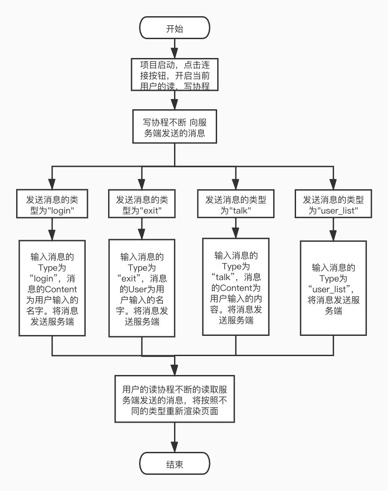

# 整体框架
```text
功能：用fyne开发聊天客户端，连接第5题的聊天服务。
1）连接管理：连接、断开、展示连接状态（连接、断开）
2）展示用户列表
3）发送消息
4）展示收到的消息
整体流程：
项目启动，用户输入用户名，点击连接按钮，启动websocket连接服务器请求。
启动用户的读，写协程。
用户的读协程：不断的读取服务端发送来的消息放入读取通道。
用户的写协程：不断的读取客户端发送的消息，发送给服务端。
fyne中开启刷新页面的协程，不断的从读取通道中读取数据：
	1.当消息类型为“login”，将用户ip，广播内容重新渲染到页面。
	2.当消息类型为“user_list”,将用户列表重新渲染到页面。
	3.当消息类型为“talk”，将用户输入的内容重新渲染到页面上。
	4.当消息类型为“exit”，将用户ip重新设为空，用户列表清空。
```


# 目录结构
```text
.
├── general.proto            //消息内容的proto文件
├── global
│   └── globalVar.go         //全局变量文件
├── go.mod
├── main
│   └── main.go              //项目启动文件
├── model
│   └── client.go            //客户端管理
├── response
│   └── general.pb.go        //消息内容的proto的go文件
├── service
│   └── clientService.go。   //客户端服务层
├── test
│   └── project6_test.go     //单元测试
└── view
    └── myApp.go             //设计页面，渲染页面
```
# 代码逻辑分层
层|文件夹|主要职责
------------ | ------------- | ------------- 
服务层|service|负责处理客户端发送消息的逻辑
实体层|model|封装客户端的读写协程代码
单元测试层|test|测试是否能连接到服务端
启动层|main|启动项目，调用应用层处理http请求
fyne页面渲染层|view|将用户输入的内容，重新渲染到页面
全局变量层|global|项目中的全局变量

# 存储设计
### 返回结果封装为Result结构：状态码，信息，数据
内容|field|类型
------------ | ------------- | ------------- 
状态码|Code|int
信息|Msg|string
数据|Data|interface{}

### 错误码和信息
错误码|信息
------------ | -------------
200|"请求成功"
3000|"rarity不能为空"
3001|"unlockArena不能为空"
3002|"cvc不能为空"
3003|"id不能为空"
4001|"数据库为空"
4002|"该用户不存在"


# 接口设计
# 需求1：输入稀有度，当前解锁阶段和cvc，获取该稀有度cvc合法且已解锁的所有士兵
### http请求方法：
http  GET
### 接口地址：
localhost:8000/soldier/getAll
### 请求参数：
参数名|参数类型|注释|是否必填
------------ | ------------- | ------------- | -------------
rarity|string|稀有度|必填
unlockArena|string|解锁阶段|必填
cvc|string|版本|必填

### 请求响应：
响应结果为json数据，数据格式如下：

参数名|参数类型|注释
------------ | ------------- | -------------
Code|int|状态码
Msg|string|信息
Data|interface{}|interface{}数据

json格式如下：
```java
{
	"code":200,
	"Msg":"找到符合信息的士兵",
	"Data": [
			{
				"id":"10102",        //士兵id
				"Name":"Swordsman",  //士兵名字
				"UnlockArena":"0",   //解锁阶段
				"Rarity":"1",        //稀有度
				"Atk":"140"          //战斗力
				"cvc":"1000"
			}
		]
}
```

# 需求2：输入士兵id获取稀有度
### http请求方法：
http  GET
### 接口地址：
localhost:8000/soldier/getRarity 
### 请求参数：
参数名|参数类型|注释|是否必填
------------ | ------------- | ------------- | -------------
id|string|士兵id|必填
### 请求响应：
响应结果为json数据，数据格式如下：

参数名|参数类型|注释
------------ | ------------- | -------------
Code|int|状态码
Msg|string|信息
Data|interface{}|interface{}数据

json格式如下：
```java
{
	"code":200,
	"Msg":"找到了该士兵的稀有度",
	"Data": 2
}
```

# 需求3：输入士兵id获取战斗力
### http请求方法：
http  GET
### 接口地址：
localhost:8000/soldier/getAtk
### 请求参数：
参数名|参数类型|注释|是否必填
------------ | ------------- | ------------- | -------------
id|string|士兵id|必填
### 请求响应：
响应结果为json数据，数据格式如下：

参数名|参数类型|注释
------------ | ------------- | -------------
Code|int|状态码
Msg|string|信息
Data|interface{}|interface{}数据

json格式如下：
```java
{
	"code":200,
	"Msg":"找到符合信息的士兵",
	"Data": 3
}
```


# 需求4：输入cvc获取所有合法的士兵 
### http请求方法：
http  GET
### 接口地址：
localhost:8000/soldier/getByCvc
### 请求参数：
参数名|参数类型|注释|是否必填
------------ | ------------- | ------------- | -------------
cvc|string|版本号|必填
### 请求响应：
响应结果为json数据，数据格式如下：

参数名|参数类型|注释
------------ | ------------- | -------------
Code|int|状态码
Msg|string|信息
Data|interface{}|interface{}数据

json格式如下：
```java
{
	"code":200,
	"msg":"请求成功",
	"data":[{
		"id":"17806",
		"Name":"Crossbowmen",
		"UnlockArena":"6",
		"Rarity":"3",
		"Atk":"269",
		"Cvc":"1000"
		},]
}
```

# 需求5：获取每个阶段解锁相应士兵的json数据
### http请求方法：
http  GET
### 接口地址：
localhost:8000/soldier/getAll/unlockArena
### 请求参数：无
### 请求响应：
响应结果为json数据，数据格式如下：

参数名|参数类型|注释
------------ | ------------- | -------------
Code|int|状态码
Msg|string|信息
Data|interface{}|interface{}数据

json格式如下：
```java
{
	"code":200,
	"Msg":"找到符合信息的士兵",
	"Data": [
			0:{
			   {
			       "id":"10102",        //士兵id
			       "Name":"Swordsman",  //士兵名字
			       "UnlockArena":"0",   //解锁阶段
			       "Rarity":"1",        //稀有度
			       "Atk":"140"          //战斗力
			       "cvc":"1000"
			    }
			}
		]
}
```

# 第三方库
### gin
```text
github.com/gin-gonic/gin
使用gin框架获取http请求以及返回http响应
```
### config
```text
github.com/robfig/config
使用这个第三方包解析app.ini配置文件
```
### pflag
```text
github.com/spf13/pflag
使用这个第三方包解析命令行参数
```
